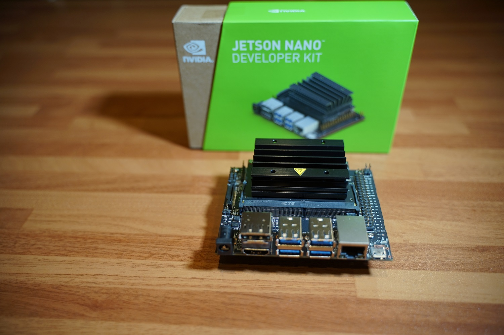
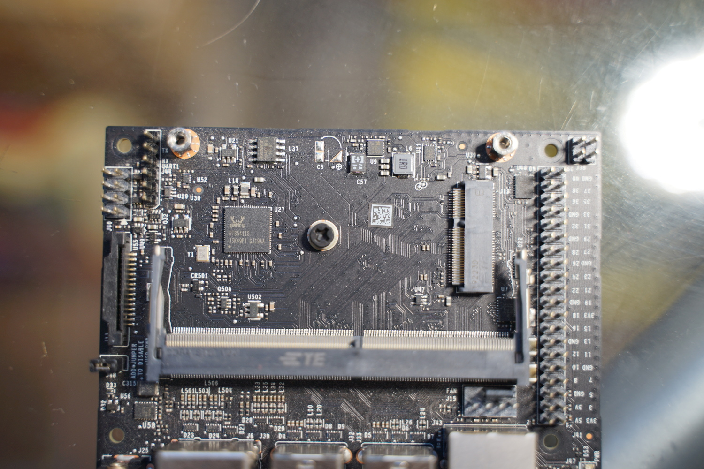
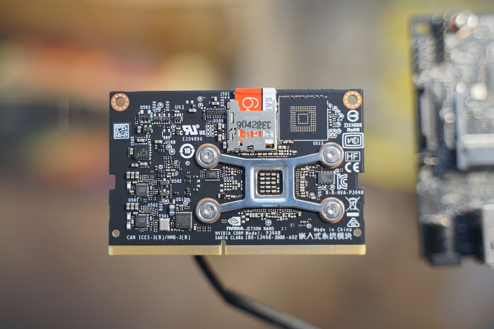
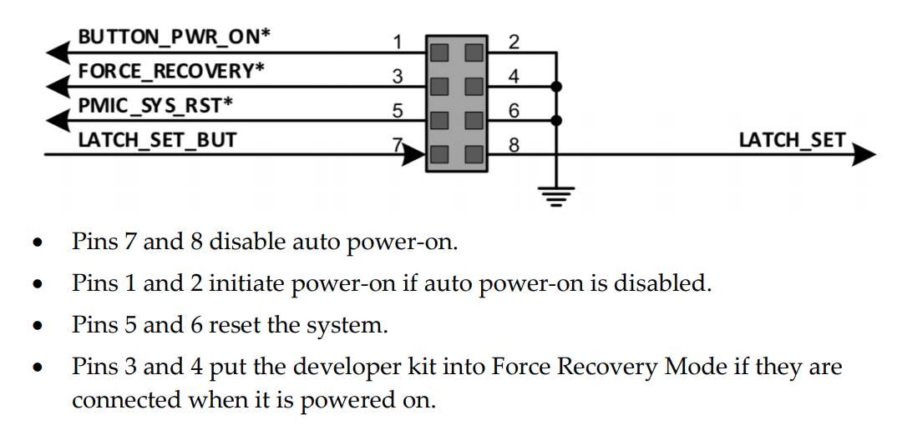
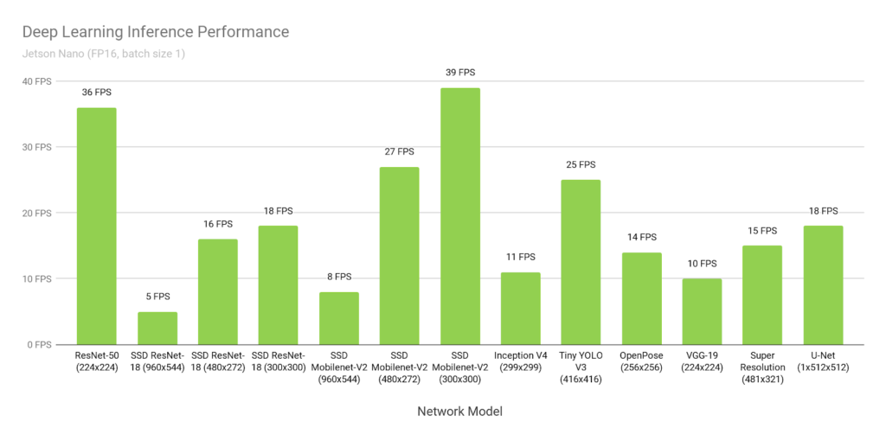
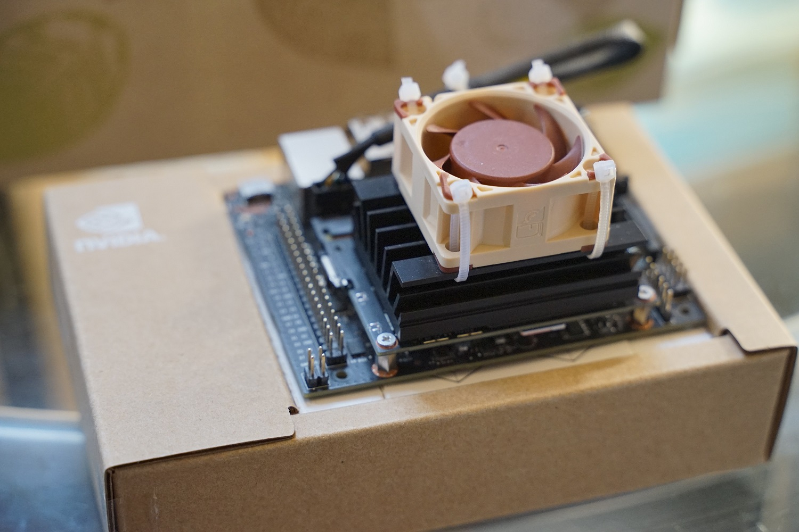
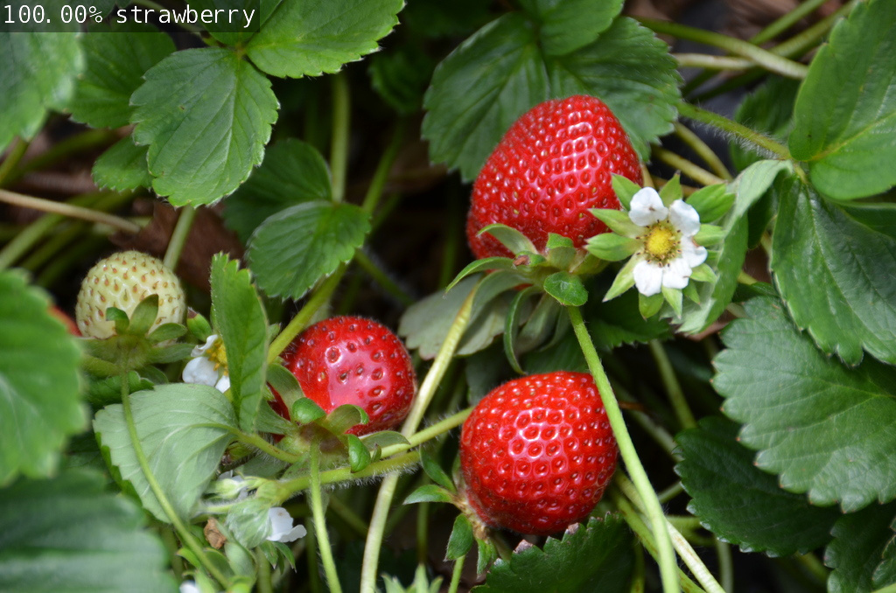

# Nvidia Jetson Nano介绍与使用指南

[toc]



> 本文介绍了Nvidia Jetson Nano的硬件参数、性能、使用方法及个人主观的使用体验。

## 1. Jetson简介

Jetson Nano是Nvidia在TX2和Xavier获得成功后推出的低配版GPU运算平台。我在Jetson Nano 2019年3月刚上市的时候就入手了一块开发套件（英国Pimoroni购入，110磅）。这次乘着短暂的假期，来补一下对它的评测。谈一个硬件平台，首先绕不开的就是它的纸面参数。在官方的资料上，Jetson Nano公布的参数如下：


Nano最大的特色就是包含了一块128核Maxwell架构的GPU，虽然已经是几代前的架构，不过因为用于嵌入式设备，从功耗、体积、价格上也算一个平衡。Nano的计算能力不高，勉强可以使用一些小规模、并且优化过的网络进行推理，训练的话还是不够用的。A53的CPU中规中矩，隔壁的树莓派4已经升级为A72。4GB的内存并不能完全使用，因为其中有一部分（1GB左右）是和显存共享的。Jetson Nano的最大优势还是在体积上，它采用核心板可拆的设计，核心板的大小只有70 x 45 mm，可以很方便的集成在各种嵌入式应用中。同时它的功耗也非常低，有两种模式：

- 5W（低功耗模式；可以使用USB口供电）
- 10W（必须使用Power Jack外接5V电源供电）

这两种模式可以在系统菜单中进行修改。当使用Power Jack供电时，外接电源要求5V=2A, 推荐使用5V=4A以应对峰值。**如果没有安装风扇，只使用自带的散热片被动散热的话，建议强制5W模式，否则一定死机。**

Jetson Nano Developer Kit的整体做工十分好，符合Nvidia的一贯质量，这里分享几个图片：


▲ Jetson Nano开发套件的背面，可见做工十分精良 ▲



▲ Jetson Nano套件的核心板为可拆卸设计，将主板拆卸后会露出一路M.2接口的单路PCIE，可接无线网卡 ▲



▲ Jetson Nano核心板的背面，也是安装SD卡的位置 ▲

Jetson Nano的硬件布局如下 (对应A02版本; B01版本除了电源按钮接口和额外一路CSI外，其他布局基本相同)：


值得注意的是，Jetson Nano除了之前提到的核心板分离式设计（J2），还包括了一个M.2接口，可以用来外接无线网卡。除此之外，Jetson Nano有与树莓派兼容的外设接口（J41）；风扇接口（J15）；摄像头接口（J13）；以及USB和HDMI。另外J40是按键接口，类似PC主板上的接口，各个接口的说明如下，不用的话直接悬空：




▲ Jetson Nano的外设接口，从左至右分别为：电源接口、HDMI、DisplayPort、USB、以太网接口及USB供电接口 ▲

Jetson Nano在上个月（2020年10月）新推出了2GB版本，内存从4GB降为2GB，4个USB3.0变为USB 3.0 x 1 + USB 2.0 x 2 + USB 2.0 Micro x 1，其他参数不变，但价格降为4GB版本的一半。这次降价的主要目的还是为了和类似的硬件平台（如树莓派4）进行竞争。本文基于Jetson Nano 4GB版本，但因为2GB版本使用完全相同的核心和系统，所以内容同样适用于2GB版本。

* * *


## 2. Jetson系列性能与参数对比

Jetson整个系列型号的对比如下：

|                   | Jetson Nano (4GB)                                  | Jetson TX1                                         | Jetson TX2/TX2i                                       | Jetson Xavier                         | Jetson Xavier Nx                                             |
| ----------------- | -------------------------------------------------- | -------------------------------------------------- | ----------------------------------------------------- | ------------------------------------- | ------------------------------------------------------------ |
| CPU (ARM)         | 4-core ARM A57 @ 1.43 GHz                          | 4-core ARM Cortex A57 @ 1.73 GHz                   | 4-core ARM Cortex-A57 @ 2 GHz, 2-core Denver2 @ 2 GHz | 8-core ARM Carmel v.8.2 @ 2.26 GHz    | 6-core NVIDIA Carmel ARM®v8.2 64-bit CPU                     |
| GPU               | 128-core Maxwell @ 921 MHz                         | 256-core Maxwell @ 998 MHz                         | 256-core Pascal @ 1.3 GHz                             | 512-core Volta @ 1.37 GHz             | 384-core NVIDIA Volta™ GPU                                   |
| Memory            | 4 GB LPDDR4, 25.6 GB/s                             | 4 GB LPDDR4, 25.6 GB/s                             | 8 GB 128-bit LPDDR4, 58.3 GB/s                        | 16 GB 256-bit LPDDR4, 137 GB/s        | 8 GB 128-bit LPDDR4x @ 1600 MHz51.2GB/s                      |
| Storage           | MicroSD                                            | 16 GB eMMC 5.1                                     | 32 GB eMMC 5.1                                        | 32 GB eMMC 5.1                        | 16 GB eMMC 5.1                                               |
| Tensor cores      | --                                                 | --                                                 | --                                                    | 64                                    | 48                                                           |
| Video encoding    | (1x) 4Kp30, (2x) 1080p60, (4x) 1080p30             | (1x) 4Kp30, (2x) 1080p60, (4x) 1080p30             | (1x) 4Kp60, (3x) 4Kp30, (4x) 1080p60, (8x) 1080p30    | (4x) 4Kp60, (8x) 4Kp30, (32x) 1080p30 | 2x464MP/sec (HEVC)2x 4K @ 30 (HEVC)6x 1080p @ 60 (HEVC)14x 1080p @ 30 (HEVC) |
| Video decoding    | (1x) 4Kp60, (2x) 4Kp30, (4x) 1080p60, (8x) 1080p30 | (1x) 4Kp60, (2x) 4Kp30, (4x) 1080p60, (8x) 1080p30 | (2x) 4Kp60, (4x) 4Kp30, (7x) 1080p60                  | (2x) 8Kp30, (6x) 4Kp60, (12x) 4Kp30   | 2x690MP/sec (HEVC)2x 4K @ 60 (HEVC)4x 4K @ 30 (HEVC)12x 1080p @ 60 (HEVC)32x 1080p @ 30 (HEVC)16x 1080p @ 30 (H.264) |
| USB               | (4x) USB 3.0 + Micro-USB 2.0                       | (1x) USB 3.0 + (1x) USB 2.0                        | (1x) USB 3.0 + (1x) USB 2.0                           | (3x) USB 3.1 + (4x) USB 2.0           |                                                              |
| PCI-Express lanes | 4 lanes PCIe Gen 2                                 | 5 lanes PCIe Gen 2                                 | 5 lanes PCIe Gen 2                                    | 16 lanes PCIe Gen 4                   | 1 x1 + 1x4(PCIe Gen3, Root Port & Endpoint)                  |
| Power             | 5W / 10W                                           | 10W                                                | 7.5W / 15W                                            | 10W / 15W / 30W                       | 10W / 15W                                                    |

可见Jetson Nano在整个系列中性能最低，但同时其也是其中价格和功耗最低的。也就是说，Jetson Nano更适合使用在算力要求较低的边缘嵌入式AI设备中。举几个我能想到的例子：小型移动机器人、人脸签到打卡、口罩识别、智能门锁、智能音箱等等。

官方给出了常见CNN模型在使用TensorRT下得出的帧率（FP16, batch size = 1）:



可见大部分模型为可用状态（FPS > 10）,其中ResNet、Mobilenet和Tiny Yolo性能优异，可以达到30帧，已经可以用于移动场景了。注意这里使用的是Nvidia自己优化的TensorRT，而不是标准的Tensor库。Nvidia没有公布太多具体的细节，但是提到使用了kernel auto-tuning、dynamic tensor memory、layer fusion和quantization (FP16/INT8) 等方法来加速网络的执行效率，这点还是非常优秀的。


* * *

## 3. Getting Started

好，做完了基本的介绍，接下来就是一些使用前的准备工作。


### 3.1 安装风扇

Jetson Nano在使用的时候**一定要用一个风扇压一下**，不然会因为被动散热能力不够而频繁死机。我用的是Noctua NF-A4x20 5V PWM。散热片的上方有四个安装风扇的固定孔，需要用自攻螺丝固定。我这里为了不造成破坏，用了四个捆扎带固定风扇。



▲ Jetson Nano安装Noctua 5v风扇 ▲

注意：风扇刚接上去不会转，要等温度到达一定值后才会启动。


### 3.2 安装无线网卡

Jetson机身只有Ethernet有线网络，不包括无线网卡，使用的时候有时候不是很方便。官方推荐使用的AC8265这款2.4G/5G双模网卡，同时支持蓝牙4.2。我这里使用的是微雪AC8265网卡 + 天线套件：


安装过程非常简单，将核心板拆卸开，露出M2接口，然后将网卡插入，用一个螺丝固定即可：


▲ 为Jetson Nano安装无线网卡 ▲

这款网卡的驱动已经集成在Jetson中，无需额外安装，进入系统后就可以直接搜索WiFi使用了。


### 3.3 安装摄像头

Jetson包含CSI相机接口（A01有一路；B02版本有两路），可以接树莓派摄像头(基于MX219)，相机接口在如下位置（安装时注意接口的正反，信号触点面朝里）：


▲ Jetson Nano CSI相机接口及电源按钮接口 ▲

摄像头连接好后可以通过以下指令测试是否工作:

```
gst-launch-1.0 nvarguscamerasrc ! 'video/x-raw(memory:NVMM),width=3820, height=2464, framerate=21/1, format=NV12' ! nvvidconv flip-method=0 ! 'video/x-raw,width=960, height=616' ! nvvidconv ! nvegltransform ! nveglglessink -e
```

当然除了使用CSI接口的摄像头外，也可以使用USB连接网络摄像头。


### 3.4 安装外壳

这么贵重的电路板还是建议使用一个外壳保护一下的。虽然有些外壳的安装步骤较为繁琐，但是可以有效的防止电路板受到损坏，还是值得的。淘宝上有很多选择，但英国这里可选的余地有限（也很贵），最后买了以下这款全金属外壳：


▲ Jetson Nano安装好后外壳后的样子。我选的这款金属外壳含电源按钮、天线固定口和相机支架 ▲

注：Jetson Nano随带的纸盒可以折叠成一个简单的底座，也可以凑合使用。


### 3.5 配置系统

1.  前往官网下载image ([https://developer.nvidia.com/embedded/learn/get-started-jetson-nano-devkit#write](https://developer.nvidia.com/embedded/learn/get-started-jetson-nano-devkit#write))
2.  将下载的image烧录至SD卡 (使用SD烧录软件，如Etcher)
3.  连接鼠标、键盘、网络、LCD
4.  上电并等待启动，不出意外的话会看见Ubuntu的桌面系统
5.  更新系统: `$ sudo apt upgrade`

整个安装过程和树莓派一样。因为使用Ubuntu系统，对SD卡的容量要求较高，需要大约15GB的空间。我用了64GB的，但是32GB也没有问题。不过16GB的卡可能不行，我配置完成已经占用了15GB了，还没有考虑之后需要配置环境以及下载DNN模型。如果需要节省空间，可以把内置的Libre Office给卸了：

```
$ sudo apt-get purge libreoffice*
$ sudo apt-get clean
```


### 3.6 安装jtop

jtop是一款开源软件，可以查看Jetson Nano的运行状态，推荐使用。jtop的GitHub链接为：https://github.com/rbonghi/jetson_stats

安装方法是： `$ sudo -H pip install -U jetson-stats`


### 3.7 使用VNC远程桌面访问Jetson（可选）

如果觉得连接屏幕使用不方便的话，也可以使用VNC实现headless远程桌面访问Jetson Nano. 需要的步骤是：

1. 修改配置: `$ sudo nano /usr/share/glib-2.0/schemas/org.gnome.Vino.gschema.xml`

在最后一个"</key>"之后，"</schema>"之前，添加:
```
<key name='enabled' type='b'>
   <summary>Enable remote access to the desktop</summary>
   <description>
   If true, allows remote access to the desktop via the RFB
   protocol. Users on remote machines may then connect to the
   desktop using a VNC viewer.
   </description>
   <default>false</default>
</key>
```
2. 编译配置: `$ sudo glib-compile-schemas /usr/share/glib-2.0/schemas`
3. 添加运行脚本: `$ nano ~/openvino`
```
#!/bin/bash
export DISPLAY=:0
gsettings set org.gnome.Vino enabled true
gsettings set org.gnome.Vino prompt-enabled false
gsettings set org.gnome.Vino require-encryption false
/usr/lib/vino/vino-server &
```
4. 添加执行权限: `$ chmod +x ~/openvino`
5. 之后通过VNC软件，如Remmina / RealVNC，就可以连接Nano了。
6. 如果需要改变屏幕分辨率，可以通过以下命令: `$ xrandr --fb 1920x1080`


* * *

## 4. Jetson开发资源

我们用Jetson进行开发的初衷就是希望通过使用GPU，实现更丰富的AI计算功能。Jetson为此提供了很好的开发套件，称为JetPack。JetPack (当前最新版本为JetPack 4.3)支持全Jetson系列模块，包括Jetson AGX Xavier, Jetson TX2/TX1以及Jetson Nano. JetPack已经包含在了官方发布的Image中，无需另外安装。JetPack目前主要包括以下组件：

- *TensorRT*和*cuDNN*：用于高性能深度学习应用
- *CUDA*：用于GPU加速计算等应用
- *Multimedia API package*：用于相机相关的应用及传感器驱动开发
- *VisionWorks*和*OpenCV*：用于计算机视觉开发

相关的示例可以在以下文件夹里找到:


关于JetPack的更多内容可见： [https://www.developer.nvidia.com/embedded/jetpack](https://www.developer.nvidia.com/embedded/jetpack)

除了JetPack，Nvidia还提供了以下开发工具：


除此之外，官网上还能找到很多Jetson的相关资源：

1. [Nvidia Developer](https://developer.nvidia.com/)
2. [Jetson Nano User Guide](https://www.developer.nvidia.com/embedded/dlc/jetson-nano-dev-kit-user-guide)
3. [Online Course: Getting Started with AI on Jetson Nano](https://courses.nvidia.com/courses/course-v1:DLI+C-RX-02+V1/about)
4. Explore at [Jetson Projects](https://developer.nvidia.com/embedded/community/jetson-projects)

这里涉及到的内容很多，无法铺开来说。这些开发工具中最有用的还是OpenCV和TensorRT了，有了这两个基本上就能满足80%的开发需要了。除此之外比较有意思的还有用于机器人的[NVIDIA Isaac SDK](https://developer.nvidia.com/isaac-sdk)和用于视频分析的[NVIDIA DeepStream SDK](https://developer.nvidia.com/Deepstream-sdk)，但是目前对Nano的支持还很有限，可以持续关注一下。

* * *

## 5. 运行Jetson Inference

为了体验Jetson的功能，我们使用Jetson Inference示例。Jetson Inference是官方推出的示例教程之一（[Tutorial: Hello, AI world](https://developer.nvidia.com/embedded/twodaystoademo#hello_ai_world)）。整个安装流程如下（安装时间较长，需耐心等待）：

``` bash
# download the repo
$ git clone --recursive https://github.com/dusty-nv/jetson-inference
$ cd jetson-inference

# configure build tree
$ mkdir build
$ cd build
$ cmake ../

# build and install
$ make -j$(nproc)
$ sudo make install
$ sudo ldconfig
```

安装过程中，会弹出提示，可以根据需要下载所需的预训练DNN模型。整个安装完成后，就可以体验Jetson Nano的示例了。这个Tutorial包含了以下三个示例：

Inference Example 1. [Classifying Images with ImageNet](https://github.com/dusty-nv/jetson-inference/blob/master/docs/imagenet-console-2.md)




Inference Example 2. [Locating Objects with DetectNet](https://github.com/dusty-nv/jetson-inference/blob/master/docs/detectnet-console-2.md)


Inference Example 3. [Semantic Segmentation with SegNet](https://github.com/dusty-nv/jetson-inference/blob/master/docs/segnet-console-2.md)


除此之外还包含了若干如何Training的教学，感兴趣的朋友自行前往阅读。

* * *

## 6. 结语

在使用了这么长的时间后，我觉得Jetson Nano的主要用处还是实现一些简单的实时视觉识别，适合一些对体积、功耗、价格有要求却需要AI功能的项目中，其余的大部分功能相比树莓派并没有明显优势，反倒问题很多（初期项目资源非常少、经常发烫死机、系统稳定性不如Raspbian、只有有线网卡、对电源要求高等）。我认为Jetson Nano的定位应该属于“入门级的边缘AI计算”，比较适合想要在现有系统的基础上增加一些深度学习功能的场景，也适合想要学习嵌入式AI部署的深度学习开发人员。想要成为主流的AI开发平台（代替高端的TX2和Xavier或者取代低端的AI芯片，如K210），Nvidia还有很长的路要走。但是作为机器人控制平台，Jetson Nano还是有比较多的可玩性的。我之后应该会利用Jetson Nano平台做一些机器人相关的应用，敬请期待。


* * *

**参考资料:**

1. Nvidia, [L4T - Jetson](https://docs.nvidia.com/jetson/l4t/index.html)
2. Nvidia Developer, [Tutorial: Hello, AI world](https://developer.nvidia.com/embedded/twodaystoademo#hello_ai_world)
3. Nvidia, [TensorRT Documentation](https://docs.nvidia.com/deeplearning/sdk/tensorrt-developer-guide/index.html)
4. Nvidia, [cuDNN Documentation](https://docs.nvidia.com/deeplearning/sdk/cudnn-developer-guide/index.html)
5. Nvidia, [CUDA Documentation](https://docs.nvidia.com/cuda/index.html)
6. Nvidia, [CUDA Profiling](https://docs.nvidia.com/cuda/profiler-users-guide/index.html)
7. Nvidia Developer, [VisionWorks](https://developer.nvidia.com/embedded/visionworks)
8. CAVEDU, [Jetson Nano新旧版本差异 - A02 vs B01](https://blog.cavedu.com/2020/03/30/jetson-nano-a02vsb01/)
